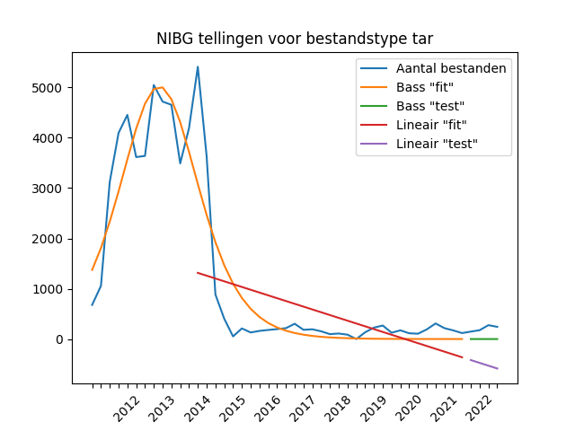

# NDE-monitoring-file-formats
Research project for the Dutch Digital Heritage Network (NDE) focused on predicting obsolete file formats

## How to use this repository
If you want to perform some of the analyses contained in this code repository, you need a recent Python installation and 
a dependency manager. I chose to use [Pipenv](https://pypi.org/project/pipenv/) because it specifies both dependencies,
the versions used and the Python version I used to create the scripts.

You can install Pipenv with:
```shell
pip install pipenv
```

after which you can install the dependencies used here with:
```shell
git clone https://github.com/Antfield-Creations/NDE-monitoring-file-formats
cd NDE-monitoring-file-formats
pipenv install
```

This will create a virtual environment (a "virtualenv") with the installed dependencies. After installation, you can run
```shell
pipenv shell
```

to log into the virtual environment. The following analyses are available for you perusal:
- The common crawl analysis: `pipenv run python -m analysis.common_crawl`
- The Netherlands Institute for Sound and Vision (NIBG): `pipenv run python -m analysis.nibg_analysis`. This, however 
  requires that you have access to a large CSV file with file metadata. You can request this data from NIBG.
- The Data Archiving and Networked services analysis is still a work in progress.

## Using this repository as a library
This code repository is installable using Pip(env), because there is a [setup.py](setup.py) installation script in the
root of this project. In the library is a Python implementation of the Bass diffusion model. It allows you to generate
data for plots like this:


### Installation
You can use the installation command as follows:
```shell
cd my_experimentation_folder
pipenv install https://github.com/Antfield-Creations/NDE-monitoring-file-formats
```

### Usage
Once you have installed the library, you can use it in Python (remember to do `pipenv run python` first):
```python
from bass_diffusion import BassDiffusionModel

bass_model = BassDiffusionModel()
times = [0, 1, 2, 3, 4, 5, 6, 7, 8, 9,]
values = [200, 300, 600, 900, 800, 500, 300, 100, 50, 20]
bass_model.fit(times, values)
interpolated = bass_model.predict([0.5, 1.5, 2.5, 3.5, 4.5, 5.5, 6.5])
```

The algorithm is very fast and can handle a lot of data. However, it's not very robust versus noise.
